# 🦴 MSFT-Net: Deep Hybrid Model for Automatic Femoral Stem Classification

---

## 🎯 What is this project about?

**MSFT-Net** is an advanced Artificial Intelligence research project developed to solve a critical challenge in orthopedic surgery: the rapid and accurate identification of femoral stem implants from hip X-ray radiographs.

By integrating multi-scale convolutional features with dual attention mechanisms — **CBAM (Convolutional Block Attention Module)** and **ECA (Efficient Channel Attention)** — this system automates classification into three primary categories:

- 🟢 Anatomical  
- 🔵 Cemented  
- 🟡 Uncemented  

The system achieves:

- ✅ **96.87% Test Accuracy**
- ✅ **Macro F1 ≈ 0.96**
- ✅ **ROC-AUC ≈ 0.99**
- ✅ **Grad-CAM Explainability**

Designed to support:

- Revision surgery planning  
- Implant compatibility verification  
- Clinical documentation validation  
- AI-assisted radiographic assessment  

---

# 📌 Project Overview

MSFT-Net (Multi-Scale Feature Transformer Network) is a **Hybrid CNN + Attention + Transformer architecture** built using:

- PyTorch
- ResNet-50 (pretrained via `timm`)
- Multi-scale feature aggregation
- Attention mechanisms (CBAM & ECA)
- Transformer encoder
- Grad-CAM for Explainable AI

---

# 🧠 Proposed Architecture: MSFT-Net

The architecture integrates:

- Pretrained ResNet-50 backbone  
- Multi-scale feature extraction (C2–C5)  
- Attention recalibration (ECA / CBAM)  
- Transformer Encoder for global context modeling  
- Fully connected classifier  

---

## 🗺 Model Architecture Flow

```mermaid
flowchart TD
  %% =======================
  %% View 1 — Workflow / Orchestration
  %% =======================

  subgraph "View 1: Offline ML Workflow (scripts + shared libs + filesystem artifacts)"
    direction TB

    subgraph "Inputs (Local/External Folders)"
      direction TB
      DATASET[/"dataset/ (image folders; train/val/test splits)"/]:::external
      TESTIMGS[/"test_images/ (demo/inference inputs)"/]:::external
    end

    subgraph "Runners (Entry-point Scripts)"
      direction TB
      MAIN["main.py (Training Orchestrator, PyTorch)"]:::entry
      EVAL["evaluate.py (Evaluation Runner)"]:::entry
      PRED["predict.py (Inference Runner)"]:::entry
      PLOT["final_metrics_plot.py (Reporting/Plotting Runner)"]:::entry
    end

    subgraph "Shared Libraries (Imported Modules)"
      direction TB

      subgraph "utils/ (Data + loops + metrics)"
        direction TB
        U_TRANS["utils/transforms.py (Preprocess + Augment)"]:::utils
        U_DATA["utils/dataset.py (Dataset + DataLoader)"]:::utils
        U_ENG["utils/engine.py (Train/Val Epoch Loops)"]:::utils
        U_MET["utils/metrics.py (F1/ROC-AUC/Confusion Matrix)"]:::utils
        U_INIT["utils/__init__.py (Package Exports)"]:::utilsMinor
      end

      subgraph "models/ (MSFT-Net)"
        direction TB
        M_MSFT["models/msftnet.py (MSFT-Net Model)"]:::model
        M_ECA["models/eca.py (ECA Attention)"]:::modelSub
        M_INIT["models/__init__.py (Package Exports)"]:::modelMinor
      end

      GC["gradcam.py (Grad-CAM Explainability Engine)"]:::xai
    end

    subgraph "Artifacts (Filesystem Integration Bus: results/ + logs)"
      direction TB
      WTS[("trained weights/checkpoints (.pth)")]:::artifact
      METJSON[("results/metrics.json (Canonical Metrics Artifact)")]:::artifact
      REVAL[("results/evaluation/ (ROC, confusion matrix, per-class outputs)")]:::artifact
      RPLOTS[("results/plots/ (figures/reports)")]:::artifact
      RGCAM[("results/gradcam/ (Grad-CAM overlay images)")]:::artifact
      LOGS[("Logs/ (optional training logs)")]:::artifactDim
    end

    %% ---- Runtime data / artifact flow (solid) ----
    DATASET -->|"images(PNG/JPG)"| U_TRANS
    U_TRANS -->|"tensors(C×H×W)"| U_DATA

    U_DATA -->|"batches(B×C×H×W)"| MAIN
    MAIN -->|"weights(.pth)"| WTS
    MAIN -->|"logs"| LOGS

    DATASET -->|"testsplit(images)"| U_DATA
    U_DATA -->|"batches"| EVAL
    WTS -->|"loadweights"| EVAL
    EVAL -->|"metrics(json)"| METJSON
    EVAL -->|"evaloutputs(files)"| REVAL

    METJSON -->|"readmetrics"| PLOT
    PLOT -->|"plots(figures)"| RPLOTS

    TESTIMGS -->|"images(PNG/JPG)"| PRED
    PRED -->|"preprocess"| U_TRANS
    WTS -->|"loadweights"| PRED
    PRED -->|"gradcaminputs(featuremaps+grads)"| GC
    GC -->|"heatmaps(overlayPNG)"| RGCAM

    %% ---- Code/module dependencies (dashed) ----
    MAIN -.->|"imports"| U_ENG
    MAIN -.->|"imports"| U_MET
    MAIN -.->|"imports"| M_MSFT
    MAIN -.->|"imports"| U_DATA
    MAIN -.->|"imports"| U_TRANS

    EVAL -.->|"imports"| U_DATA
    EVAL -.->|"imports"| U_MET
    EVAL -.->|"imports"| M_MSFT

    PRED -.->|"imports"| M_MSFT
    PRED -.->|"imports"| GC
    PRED -.->|"imports"| U_TRANS

    M_MSFT -.->|"uses"| M_ECA
    U_DATA -.->|"exports"| U_INIT
    M_MSFT -.->|"exports"| M_INIT
  end

  %% =======================
  %% View 2 — Model Internals (MSFT-Net)
  %% =======================

  subgraph "View 2: MSFT-Net Internal Architecture (models/msftnet.py)"
    direction TB

    IN["Input tensor (B×C×H×W)"]:::tensor
    BACKBONE["ResNet-50 Backbone (timm pretrained)\n(local feature extraction)"]:::model
    MSCALE["Multi-scale feature aggregation (C2–C5)\n(multi-resolution features)"]:::model
    ECAI["ECA Attention (models/eca.py)\n(channel recalibration)"]:::modelSub
    TR["Transformer Encoder\n(global context modeling)"]:::model
    HEAD["Pooling/Flatten + Classifier Head\n(3-class logits)"]:::model
    OUT["Output logits/softmax\n(3 stem types)"]:::tensor

    IN -->|"forward"| BACKBONE
    BACKBONE -->|"featuremaps"| MSCALE
    MSCALE -->|"reweightedfeatures"| ECAI
    ECAI -->|"sequence/embeddings"| TR
    TR -->|"contextfeatures"| HEAD
    HEAD -->|"logits"| OUT
  end

  %% =======================
  %% View 3 — Metrics + Explainability Subsystem
  %% =======================

  subgraph "View 3: Metrics + Reporting + Explainability"
    direction TB

    subgraph "Metrics/Reporting"
      direction TB
      METSYS["utils/metrics.py\n(F1 macro/weighted, ROC-AUC OVR, confusion matrix)"]:::utils
      EVALRUN["evaluate.py (runs test set)"]:::entry
      MJSON[("results/metrics.json")]:::artifact
      EFILES[("results/evaluation/")]:::artifact
      PLOTRUN["final_metrics_plot.py (builds figures)"]:::entry
      PFILES[("results/plots/")]:::artifact
      EVALRUN -->|"computemetrics"| METSYS
      METSYS -->|"write"| MJSON
      METSYS -->|"write"| EFILES
      MJSON -->|"consume"| PLOTRUN
      PLOTRUN -->|"write"| PFILES
    end

    subgraph "Explainability (XAI)"
      direction TB
      PRUN["predict.py (inference)"]:::entry
      GCE["gradcam.py (Grad-CAM engine)"]:::xai
      GCF[("results/gradcam/")]:::artifact
      PRUN -->|"calls"| GCE
      GCE -->|"writeoverlays"| GCF
    end
  end

  %% =======================
  %% External dependencies (footnote cluster)
  %% =======================
  subgraph "External Dependencies (Libraries)"
    direction TB
    TORCH["PyTorch"]:::dep
    TIMM["timm/torchvision (pretrained backbones)"]:::dep
    SK["scikit-learn (metrics)"]:::dep
    CV["OpenCV (image I/O; overlays)"]:::dep
    MPL["matplotlib/seaborn (plots)"]:::dep
    NP["NumPy"]:::dep
    AUG["albumentations/torchvision transforms"]:::dep
  end

  %% Light-touch dependency hints
  U_MET -.->|"uses"| SK
  M_MSFT -.->|"uses"| TORCH
  M_MSFT -.->|"uses"| TIMM
  U_TRANS -.->|"uses"| AUG
  GC -.->|"uses"| CV
  PLOT -.->|"uses"| MPL
  U_DATA -.->|"uses"| NP

  %% =======================
  %% Click events (from component_mapping)
  %% =======================
  click MAIN "https://github.com/rogerjaden/deep-hybrid-model-for-classification-of-femoral-stem/blob/experiment-eca/main.py"
  click EVAL "https://github.com/rogerjaden/deep-hybrid-model-for-classification-of-femoral-stem/blob/experiment-eca/evaluate.py"
  click PRED "https://github.com/rogerjaden/deep-hybrid-model-for-classification-of-femoral-stem/blob/experiment-eca/predict.py"
  click PLOT "https://github.com/rogerjaden/deep-hybrid-model-for-classification-of-femoral-stem/blob/experiment-eca/final_metrics_plot.py"
  click GC "https://github.com/rogerjaden/deep-hybrid-model-for-classification-of-femoral-stem/blob/experiment-eca/gradcam.py"

  click U_DATA "https://github.com/rogerjaden/deep-hybrid-model-for-classification-of-femoral-stem/blob/experiment-eca/utils/dataset.py"
  click U_TRANS "https://github.com/rogerjaden/deep-hybrid-model-for-classification-of-femoral-stem/blob/experiment-eca/utils/transforms.py"
  click U_ENG "https://github.com/rogerjaden/deep-hybrid-model-for-classification-of-femoral-stem/blob/experiment-eca/utils/engine.py"
  click U_MET "https://github.com/rogerjaden/deep-hybrid-model-for-classification-of-femoral-stem/blob/experiment-eca/utils/metrics.py"
  click U_INIT "https://github.com/rogerjaden/deep-hybrid-model-for-classification-of-femoral-stem/blob/experiment-eca/utils/__init__.py"

  click M_MSFT "https://github.com/rogerjaden/deep-hybrid-model-for-classification-of-femoral-stem/blob/experiment-eca/models/msftnet.py"
  click M_ECA "https://github.com/rogerjaden/deep-hybrid-model-for-classification-of-femoral-stem/blob/experiment-eca/models/eca.py"
  click M_INIT "https://github.com/rogerjaden/deep-hybrid-model-for-classification-of-femoral-stem/blob/experiment-eca/models/__init__.py"

  click METJSON "https://github.com/rogerjaden/deep-hybrid-model-for-classification-of-femoral-stem/blob/experiment-eca/results/metrics.json"
  click REVAL "https://github.com/rogerjaden/deep-hybrid-model-for-classification-of-femoral-stem/tree/experiment-eca/results/evaluation/"
  click RPLOTS "https://github.com/rogerjaden/deep-hybrid-model-for-classification-of-femoral-stem/tree/experiment-eca/results/plots/"
  click RGCAM "https://github.com/rogerjaden/deep-hybrid-model-for-classification-of-femoral-stem/tree/experiment-eca/results/gradcam/"
  click TESTIMGS "https://github.com/rogerjaden/deep-hybrid-model-for-classification-of-femoral-stem/tree/experiment-eca/test_images/"

  %% =======================
  %% Styles
  %% =======================
  classDef entry fill:#1e88e5,stroke:#0d47a1,color:#ffffff,stroke-width:1.5px
  classDef utils fill:#fb8c00,stroke:#e65100,color:#111111,stroke-width:1.3px
  classDef utilsMinor fill:#ffcc80,stroke:#ef6c00,color:#111111,stroke-width:1px
  classDef model fill:#43a047,stroke:#1b5e20,color:#ffffff,stroke-width:1.5px
  classDef modelSub fill:#81c784,stroke:#1b5e20,color:#111111,stroke-width:1.2px
  classDef modelMinor fill:#c5e1a5,stroke:#1b5e20,color:#111111,stroke-width:1px
  classDef xai fill:#8e24aa,stroke:#4a148c,color:#ffffff,stroke-width:1.5px
  classDef artifact fill:#90a4ae,stroke:#37474f,color:#111111,stroke-width:1.3px
  classDef artifactDim fill:#cfd8dc,stroke:#607d8b,color:#111111,stroke-width:1px
  classDef external fill:#7e57c2,stroke:#311b92,color:#ffffff,stroke-width:1.4px
  classDef tensor fill:#26a69a,stroke:#004d40,color:#ffffff,stroke-width:1.2px
  classDef dep fill:#eeeeee,stroke:#616161,color:#111111,stroke-width:1px,stroke-dasharray: 4 3
```



---

# 🔬 Attention Mechanisms: CBAM vs ECA

## 🔷 CBAM — Convolutional Block Attention Module

CBAM applies attention sequentially:

1. Channel Attention (MLP-based)
2. Spatial Attention (7×7 convolution)

```
Input → Channel Attention → Spatial Attention → Output
```

✔ Rich spatial awareness  
✔ Strong localization  
❌ Higher parameter cost  

---

## 🔶 ECA — Efficient Channel Attention (Selected)

ECA improves efficiency by:

- Using global average pooling
- Applying adaptive 1D convolution across channels
- Avoiding dimensionality reduction

```
Input → AvgPool → 1D Conv → Sigmoid → Channel Weights → Output
```

✔ Near-zero parameter overhead  
✔ No bottleneck  
✔ Faster inference  
✔ Better scaling at 2048 channels  

---

## ⚖️ CBAM vs ECA Comparison

| Feature | CBAM | ECA |
|----------|------|------|
| Channel Attention | MLP | 1D Conv |
| Spatial Attention | Yes | No |
| Dimensionality Reduction | Yes | No |
| Parameters | Higher | Very Low |
| Speed | Moderate | Fast |
| Final Model | Baseline | ✅ Selected |

---

# 📊 Dataset

- **2,744 Hip X-ray Images**
- 3 classes:
  - Anatomical
  - Cemented
  - Uncemented

Structure:

```
dataset/
    anatomical/
    cemented/
    uncemented/
```

---

# 🏆 Model Performance

## Final Results

- ✅ Test Accuracy: **96.87%**
- ✅ Macro F1-Score: **0.96**
- ✅ Weighted F1-Score: **0.96**
- ✅ ROC-AUC: **~0.99**

### Class-wise Metrics

| Class | Precision | Recall | F1 |
|--------|------------|--------|----|
| Anatomical | 0.96 | 0.97 | 0.96 |
| Cemented | 0.97 | 0.97 | 0.97 |
| Uncemented | 0.99 | 0.96 | 0.97 |

---

# 📈 Evaluation Outputs

Automatically generated:

- Confusion Matrix
- ROC Curves
- F1 Comparison Plot
- Key Metrics Visualization
- Training vs Validation Curves
- Grad-CAM Heatmaps
- Persistent Logs (`Logs/`)

Stored in:

```
results/
    evaluation/
    plots/
    gradcam/
Logs/
```

---

# 🔍 Explainability (Grad-CAM)

Grad-CAM is implemented to:

- Highlight implant regions influencing classification
- Improve clinical trust
- Validate model attention focus

---

# 🛠 Tech Stack

- Python  
- PyTorch  
- timm  
- scikit-learn  
- NumPy  
- Matplotlib  
- OpenCV  
- Albumentations  

---

# 🚀 How to Run

## 1️⃣ Install Dependencies

```bash
pip install -r requirements.txt
```

or

```bash
./install_dependencies.bat
```

---

## 2️⃣ (Optional) Mock Setup

```bash
python setup_mock.py
```

---

## 3️⃣ Train

```bash
python main.py
```

---

## 4️⃣ Evaluate

```bash
python evaluate.py
```

---

## 5️⃣ Predict + Grad-CAM

```bash
python predict.py
```

---

# 📁 Project Structure

```
FinalYearProject/
│
├── dataset/
├── models/
│   ├── msftnet.py
│   ├── eca.py
│   ├── cbam.py
│
├── utils/
├── results/
├── Logs/
│
├── main.py
├── evaluate.py
├── predict.py
├── requirements.txt
└── install_dependencies.bat
```

---

# 🔮 Future Improvements

- Formal ablation study (CBAM vs ECA vs SE-Net)
- Switchable attention modes
- Web deployment with live Grad-CAM
- PACS / DICOM integration
- Multi-hospital validation
- Cross-scanner generalization testing

---

# 🎓 Academic Context

Developed as a Final Year Research Project focusing on:

- Deep Learning in Medical Imaging
- Hybrid CNN–Transformer Architectures
- Attention Mechanism Optimization
- Explainable AI in Healthcare
- Efficient Model Deployment

---

# ⚠ Disclaimer

This system is intended for academic and research purposes only and should not replace professional medical judgment.
