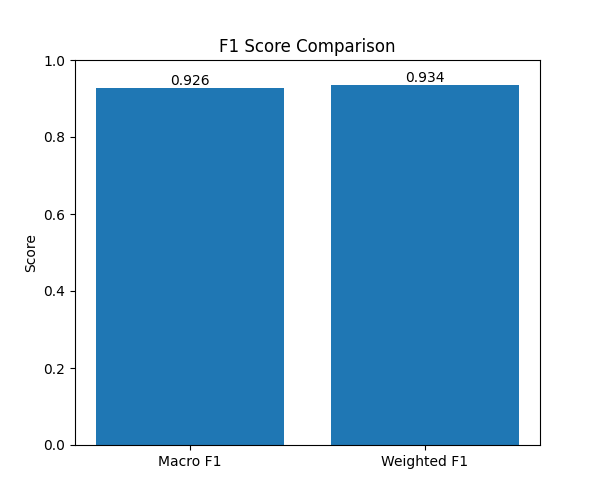
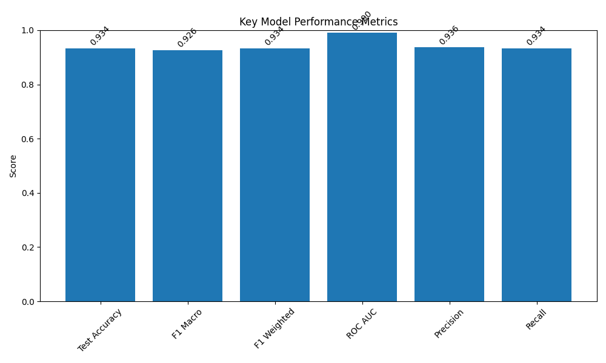

# 🦴 MSFT-Net: Deep Hybrid Model for Automatic Femoral Stem Classification

---

## 📌 Project Overview

This project presents a medical AI system for automatically classifying femoral stem implant types from hip X-ray radiographs using a deep hybrid neural network architecture.

The proposed model, MSFT-Net (Multi-Scale Feature Transformer Network), combines:

- Convolutional Neural Networks (CNN)
- Attention Mechanisms (CBAM / alternatives)
- Transformer Encoder Modules

to accurately classify implant types into:

- 🟢 Anatomical
- 🔵 Cemented
- 🟡 Uncemented

---

## 🎯 Problem Statement

In hip arthroplasty (hip replacement surgery), identifying the correct femoral stem implant type is critical for:

- Revision surgeries
- Pre-operative planning
- Implant compatibility
- Clinical documentation verification

Manual identification from radiographs can be:

- Time-consuming
- Error-prone
- Dependent on expert knowledge

This project automates implant classification using deep learning.

---

---

## � Visual Results & Analytics

### 🔍 Grad-CAM: Input vs. Explanation
Grad-CAM (Gradient-weighted Class Activation Mapping) helps visualize which parts of the X-ray the model prioritized for its classification.

| Sample Input (Raw X-Ray) | Model Explanation (Grad-CAM) |
|:---:|:---:|
| .png) | .png) |
| *Example Input: Loose Stem* | *Heatmap highlighting the loose femoral stem region* |

---

### 📈 Model Metrics Plots
The following plots illustrate the performance and stability of MSFT-Net across all classes.

| F1-Score Comparison | Key Model Metrics |
|:---:|:---:|
|  |  |

---

---

## �🚦 Project Status & Highlights
- **Performance:** Achieved **93.37% test accuracy** across three classes.
- **Explainability:** Integrated **Grad-CAM** heatmaps to provide visual evidence for clinical trust.
*   **Architecture:** Upgraded to **ECA (Efficient Channel Attention)** for high efficiency in medical imaging.
*   **Ready-to-Run:** Includes a **Mock Simulation** environment to test full pipeline functionality instantly.

---

## 🧠 Proposed Architecture: MSFT-Net

The architecture integrates:

- Multi-Scale Feature Extraction
- Pretrained ResNet backbone
- **Efficient Channel Attention (ECA)**
  - Local cross-channel interaction without dimensionality reduction
  - Extremely lightweight and faster than standard mechanisms
- Transformer Encoder Module
  - Captures global contextual relationships
- Fully Connected Classifier

### 🗺 Model Architecture Flow

```mermaid
flowchart TD

%% =========================
%% Legend
%% =========================
subgraph "Legend"
direction TB
L1["Blue: Entry scripts (pipelines)"]:::script
L2["Orange: Shared utilities (data/engine/metrics)"]:::util
L3["Green: Model code (MSFT-Net components)"]:::model
L4[("Gray cylinder: Artifacts in results/")]:::artifact
L5["Solid arrow: data/artifact flow"]:::note
L6["Dashed arrow: code dependency"]:::note
end

%% =========================
%% Swimlane 1: Inputs
%% =========================
subgraph "Inputs"
direction TB
DATASET["dataset/ (X-ray images)\n- anatomical/\n- cemented/\n- uncemented/"]:::data
TESTIMAGES["test_images/ (new X-ray inputs)"]:::data
end

%% =========================
%% Swimlane 2: Shared Libraries
%% =========================
subgraph "Core Libraries (shared)"
direction TB

subgraph "utils/ (PyTorch + Albumentations + scikit-learn)"
direction TB
UT_INIT["utils/__init__.py\n(package exports)"]:::util
UT_TRANS["utils/transforms.py\naugmentation + preprocessing\n(Albumentations/torchvision)"]:::util
UT_DATA["utils/dataset.py\nDataset/DataLoader wiring\n(PyTorch)"]:::util
UT_ENGINE["utils/engine.py\ntrain/val loops + device mgmt\n(PyTorch)"]:::util
UT_METRICS["utils/metrics.py\nF1/ROC-AUC/confusion matrix\n(scikit-learn)"]:::util
end

subgraph "models/ (PyTorch)"
direction TB
M_INIT["models/__init__.py\n(package exports)"]:::model
MSFT["models/msftnet.py\nMSFT-Net (CNN + ECA + Transformer + Classifier)"]:::model
ECA["models/eca.py\nECA attention module"]:::model
GCAM["gradcam.py\nExplainability Engine\n(Grad-CAM heatmaps)"]:::model
end
end

%% =========================
%% Swimlane 3: Runners (entry points)
%% =========================
subgraph "Runners (entry points)"
direction TB
TRAIN["main.py\nOffline training pipeline\n(3-class classification)"]:::script
EVAL["evaluate.py\nOffline evaluation pipeline\n(metrics + eval outputs)"]:::script
PRED["predict.py\nInference/prediction pipeline\n(Inference + Grad-CAM)"]:::script
REPORT["final_metrics_plot.py\nReporting/visualization pipeline\n(Matplotlib/Seaborn)"]:::script
end

%% =========================
%% Swimlane 4: Artifacts (results/)
%% =========================
subgraph "Artifacts (results/)"
direction TB
RESULTS[("results/ (artifact store)")]:::artifact
METJSON[("results/metrics.json\ncanonical metrics artifact")]:::artifact
EVALOUT[("results/evaluation/\nconfusion matrix + ROC + per-class outputs")]:::artifact
PLOTS[("results/plots/\ntraining curves + metric comparisons")]:::artifact
GCAMOUT[("results/gradcam/\nGrad-CAM overlay images")]:::artifact
end

%% =========================
%% Data flow: Inputs -> utils -> runners -> artifacts
%% =========================
DATASET -->|"images"| UT_TRANS -->|"tensors"| UT_DATA
TESTIMAGES -->|"images"| UT_TRANS

UT_DATA -->|"batches"| TRAIN
UT_DATA -->|"test-batches"| EVAL

UT_TRANS -->|"preprocessed-image"| PRED

%% =========================
%% Code dependencies (dashed)
%% =========================
TRAIN -.->|"uses"| UT_ENGINE
TRAIN -.->|"uses"| UT_METRICS
TRAIN -.->|"uses"| MSFT

EVAL -.->|"uses"| UT_DATA
EVAL -.->|"uses"| UT_METRICS
EVAL -.->|"loads"| MSFT

PRED -.->|"loads"| MSFT
PRED -.->|"uses"| GCAM

REPORT -.->|"reads"| METJSON

MSFT -.->|"uses"| ECA
UT_INIT -.->|"exports"| UT_TRANS
UT_INIT -.->|"exports"| UT_DATA
UT_INIT -.->|"exports"| UT_ENGINE
UT_INIT -.->|"exports"| UT_METRICS
M_INIT -.->|"exports"| MSFT
M_INIT -.->|"exports"| ECA

%% =========================
%% Artifact flow
%% =========================
TRAIN -->|"trained-model (saved weights)"| RESULTS
EVAL -->|"writes"| METJSON
EVAL -->|"writes"| EVALOUT
METJSON -->|"input"| REPORT
REPORT -->|"writes"| PLOTS
PRED -->|"writes heatmaps"| GCAMOUT

RESULTS -->|"contains"| METJSON
RESULTS -->|"contains"| EVALOUT
RESULTS -->|"contains"| PLOTS
RESULTS -->|"contains"| GCAMOUT

%% =========================
%% Model Internal Architecture (MSFT-Net)
%% =========================
subgraph "MSFT-Net internal architecture (from models/msftnet.py)"
direction TB
XIN["Input: X-ray tensor\n(after transforms)"]:::model
BACKB["Backbone: Pretrained ResNet\n(torchvision/timm)"]:::model
MSCALE["Multi-scale feature maps\n(C2/C3/C4/C5)"]:::model
ATTN["ECA attention\n(models/eca.py)"]:::model
TRANS["Transformer encoder\n(global context modeling)"]:::model
HEAD["Classifier head\n(FC layers)"]:::model
OUT["Output: Softmax logits\n3 classes:\nAnatomical / Cemented / Uncemented"]:::model

XIN --> BACKB --> MSCALE --> ATTN --> TRANS --> HEAD --> OUT
end

%% Tie shared model node to internal view
MSFT -.->|"implements"| XIN

%% =========================
%% Click events (from component mapping)
%% =========================
click TRAIN "https://github.com/rogerjaden/deep-hybrid-model-for-classification-of-femoral-stem/blob/main/main.py"
click EVAL "https://github.com/rogerjaden/deep-hybrid-model-for-classification-of-femoral-stem/blob/main/evaluate.py"
click PRED "https://github.com/rogerjaden/deep-hybrid-model-for-classification-of-femoral-stem/blob/main/predict.py"
click GCAM "https://github.com/rogerjaden/deep-hybrid-model-for-classification-of-femoral-stem/blob/main/gradcam.py"
click REPORT "https://github.com/rogerjaden/deep-hybrid-model-for-classification-of-femoral-stem/blob/main/final_metrics_plot.py"

click MSFT "https://github.com/rogerjaden/deep-hybrid-model-for-classification-of-femoral-stem/blob/main/models/msftnet.py"
click ECA "https://github.com/rogerjaden/deep-hybrid-model-for-classification-of-femoral-stem/blob/main/models/eca.py"
click M_INIT "https://github.com/rogerjaden/deep-hybrid-model-for-classification-of-femoral-stem/blob/main/models/__init__.py"

click UT_DATA "https://github.com/rogerjaden/deep-hybrid-model-for-classification-of-femoral-stem/blob/main/utils/dataset.py"
click UT_TRANS "https://github.com/rogerjaden/deep-hybrid-model-for-classification-of-femoral-stem/blob/main/utils/transforms.py"
click UT_ENGINE "https://github.com/rogerjaden/deep-hybrid-model-for-classification-of-femoral-stem/blob/main/utils/engine.py"
click UT_METRICS "https://github.com/rogerjaden/deep-hybrid-model-for-classification-of-femoral-stem/blob/main/utils/metrics.py"
click UT_INIT "https://github.com/rogerjaden/deep-hybrid-model-for-classification-of-femoral-stem/blob/main/utils/__init__.py"

click RESULTS "https://github.com/rogerjaden/deep-hybrid-model-for-classification-of-femoral-stem/tree/main/results/"
click METJSON "https://github.com/rogerjaden/deep-hybrid-model-for-classification-of-femoral-stem/blob/main/results/metrics.json"
click EVALOUT "https://github.com/rogerjaden/deep-hybrid-model-for-classification-of-femoral-stem/tree/main/results/evaluation/"
click GCAMOUT "https://github.com/rogerjaden/deep-hybrid-model-for-classification-of-femoral-stem/tree/main/results/gradcam/"
click PLOTS "https://github.com/rogerjaden/deep-hybrid-model-for-classification-of-femoral-stem/tree/main/results/plots/"

click TESTIMAGES "https://github.com/rogerjaden/deep-hybrid-model-for-classification-of-femoral-stem/tree/main/test_images/"

%% =========================
%% Styles
%% =========================
classDef script fill:#1f77b4,stroke:#0b3d66,color:#ffffff,stroke-width:1px
classDef util fill:#ff7f0e,stroke:#7a3a00,color:#ffffff,stroke-width:1px
classDef model fill:#2ca02c,stroke:#145214,color:#ffffff,stroke-width:1px
classDef artifact fill:#9aa0a6,stroke:#4b4f54,color:#111111,stroke-width:1px
classDef data fill:#9467bd,stroke:#3f2a63,color:#ffffff,stroke-width:1px
classDef note fill:#f2f2f2,stroke:#cccccc,color:#111111,stroke-width:1px
```


---

## 📊 Dataset

- 2,744 hip X-ray images
- 3 implant classes:
  - Anatomical
  - Cemented
  - Uncemented

Images are organized as:

```text
dataset/
    anatomical/
    cemented/
    uncemented/
```

---

## 🏆 Model Performance

### Final Evaluation Results:

- ✅ Test Accuracy: 93.37%
- ✅ Macro F1-Score: 0.93
- ✅ Weighted F1-Score: 0.93
- ✅ ROC-AUC (OVR): ~0.93+

### Class-wise Performance:

| Class       | Precision | Recall | F1-Score |
|------------|-----------|--------|----------|
| Anatomical | 0.90      | 0.96   | 0.93     |
| Cemented   | 0.98      | 0.91   | 0.94     |
| Uncemented | 0.89      | 0.92   | 0.90     |

---

## 📈 Evaluation Outputs

The system automatically generates:

- Confusion Matrix
- ROC Curve
- F1 Score Comparison
- Key Metrics Visualization
- Training vs Validation Loss Graph
- Grad-CAM Visual Explanations
- **Persistent Text Logs** (Saved in `Logs/`)

All results are saved inside:

```text
results/
    evaluation/
    plots/
    gradcam/
Logs/
```

---

## 🔬 Explainability (Grad-CAM)

To improve interpretability in medical settings, Grad-CAM is implemented to:

- Highlight regions influencing predictions
- Verify model focuses on implant structure
- Improve trust in AI decisions

---

## 🛠 Tech Stack


---

## 🚀 How to Run

### 1. Initial Setup
Run the automated installer to set up all dependencies:
```bash
./install_dependencies.bat
```

### 2. Mock Test (Optional)
If you don't have the dataset yet, run this to generate dummy data and weights for a dry run:
```bash
python setup_mock.py
```

### 3. Training
```bash
python main.py
```

### 4. Evaluation
```bash
python evaluate.py
```

### 5. Predict & Explain
Run prediction and generate Grad-CAM heatmaps on test images:
```bash
python predict.py
```

---

## 📁 Project Structure

```text
FinalYearProject/
│
├── dataset/             # Hip X-ray dataset (Anatomical, Cemented, Uncemented)
├── models/
│   ├── msftnet.py       # Main Hybrid Architecture
│   ├── eca.py           # Efficient Channel Attention Module
│   ├── cbam.py          # (Legacy) Convolutional Block Attention
│
├── utils/               # Dataset loaders, transforms, and training engine
├── results/             # Plots and Grad-CAM visualizations
├── Logs/                # Auto-generated CSV/Text logs for all runs
│
├── main.py              # Training Entry Point
├── evaluate.py          # Metric & Visualization Generator
├── predict.py           # Single-image inference + Explainability
├── requirements.txt     # Library dependencies
└── install_dependencies.bat # Windows Automated Setup Script
```

---

## 🔎 Future Improvements

- Compare attention mechanisms (SE, ECA, Coordinate Attention)
- Deploy as web application
- Integrate into PACS system
- Expand dataset
- Perform cross-hospital validation

---

## 🎓 Academic Context

This project was developed as a Final Year Research Project focusing on:

- Deep Learning in Medical Imaging
- Attention-based Neural Networks
- Explainable AI in Healthcare

---

## ⚠ Disclaimer

This model is intended for research and academic purposes only and should not replace clinical judgment.
